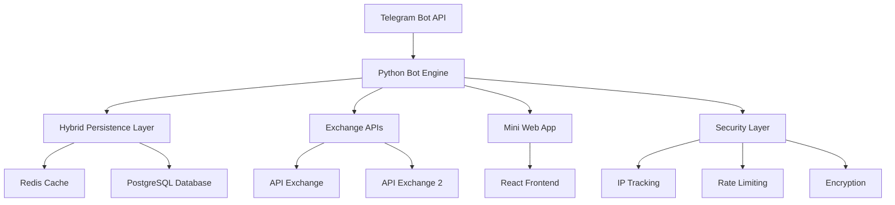

<div align="center">

<!-- Brand Header with Logo -->
<div align="center">
  
  <br/><br/>
</div>

<!-- Professional Animated Banner -->
<div align="center">
  
</div>

<!-- Modern SVG Banner Alternative -->
<!--
<div align="center">
  <svg width="800" height="200" xmlns="http://www.w3.org/2000/svg">
    <defs>
      <linearGradient id="grad1" x1="0%" y1="0%" x2="100%" y2="0%">
        <stop offset="0%" style="stop-color:#0D1421;stop-opacity:1" />
        <stop offset="100%" style="stop-color:#00FF88;stop-opacity:1" />
      </linearGradient>
    </defs>
    <rect width="800" height="200" fill="url(#grad1)" rx="20"/>
    <text x="400" y="80" font-family="Arial, sans-serif" font-size="36" font-weight="bold" text-anchor="middle" fill="white">🚀 CryptoFedia Exchange</text>
    <text x="400" y="120" font-family="Arial, sans-serif" font-size="18" text-anchor="middle" fill="white">Next-Generation Telegram Trading Bot</text>
    <text x="400" y="150" font-family="Arial, sans-serif" font-size="16" text-anchor="middle" fill="#FFD700">3000+ Routes • 40+ Networks • Built by Benjamin White</text>
  </svg>
</div>
-->

<!-- Alternative Professional Headers (choose one) -->
<!-- 
<div align="center">
  
</div>

<div align="center">
  
</div>

<div align="center">
  
</div>
-->

<!-- Animated Title with CSS -->
<h1 align="center">
  
</h1>

<!-- Glowing Animation Effect -->
<div>
  
</div>

<!-- Animated Badges with Dark Theme -->
<div align="center">
  <a href="https://t.me/CryptoFediaOfficialBot">
    
  </a>
  
  
</div>

<br/>

<!-- Animated Network Icons -->
<div align="center">
  
  
  
  
  
</div>

<!-- Referral Earnings Banner -->
<div align="center">
  <br/>
  
  
  <!-- Instant Earning Highlight -->
  <div style="background: linear-gradient(45deg, #0D1421, #1a2332); border: 2px solid #00FF88; border-radius: 10px; padding: 15px; margin: 20px 0;">
    
  </div>
  <br/>
</div>

<!-- Matrix-style animated background -->
<div align="center">
  
</div>

<!-- Stylized Description -->
<div align="center">

```diff
+ 🌍 The World's Most Advanced Telegram Crypto Exchange Bot 🌍
+ Revolutionary Multi-Exchange Platform with Enterprise-Grade Architecture
```

</div>

<!-- Animated Stats Bar -->
<div align="center">

### 🚀 **583 Million+ Sessions** • 🔒 **Military-Grade Security** • 🌐 **20+ Languages** • ⚡ **3000+ Routes**

</div>

---

<!-- Performance Indicators -->
<div align="center">
  
  
</div>

<!-- SEO Meta Tags for GitHub -->
<meta name="description" content="CryptoFedia - Advanced Telegram crypto exchange bot with 3000+ trading routes, 40+ blockchain networks, API Exchange integration. Built by Benjamin White CEO. Bitcoin, Ethereum, Solana, Polygon, Arbitrum trading.">
<meta name="keywords" content="telegram bot, crypto exchange, cryptocurrency trading, bitcoin, ethereum, solana, polygon, arbitrum, bsc, tron, avalanche, cardano, polkadot, api exchange, multi-exchange, blockchain, defi, trading bot, crypto swap, digital assets, benjamin white, cryptofedia, telegram crypto bot, multi-exchange, cross-chain, web3, 3000 routes, layer 2, enterprise bot, military grade security, real-time rates, inline queries, referral rewards, usdt polygon">
<meta name="author" content="Benjamin White - CEO & Founder of CryptoFedia">
<meta property="og:title" content="CryptoFedia - 3000+ Routes Telegram Exchange Bot by Benjamin White">
<meta property="og:description" content="Revolutionary Telegram bot supporting 3000+ crypto trading routes across 40+ blockchain networks including Bitcoin, Ethereum, Solana, Polygon. Enterprise-grade architecture with military-level security. Built by Benjamin White.">
<meta property="og:url" content="https://t.me/CryptoFediaOfficialBot">
<meta property="og:type" content="website">
<meta name="twitter:card" content="summary_large_image">
<meta name="twitter:title" content="CryptoFedia Exchange Bot - 3000+ Trading Routes | 40+ Networks | Benjamin White CEO">
<meta name="twitter:description" content="Advanced Telegram crypto exchange bot with multi-exchange integration, 40+ blockchain networks, and enterprise security. API Exchange integration. Built by Benjamin White.">

</div>

<div align="center">

## 🎯 **What is CryptoFedia?**

**CryptoFedia** is a cutting-edge Telegram bot that revolutionizes cryptocurrency trading by providing seamless access to **3000+ trading routes** across **40+ blockchain networks** directly through Telegram. Built with enterprise-grade architecture and featuring advanced Web3 integration, it connects multiple API exchanges to deliver the best rates for both novice and professional traders worldwide.

### 🏆 **Why Choose CryptoFedia?**

🚀 **Blazing Fast Performance** - Sub-second response times with Redis caching  
🔗 **Multi-Exchange Integration** - Access to multiple API exchanges and more  
🌐 **Global Reach** - Support for 20+ languages worldwide  
🔒 **Bank-Level Security** - Military-grade encryption and compliance  
📱 **Modern UI/UX** - Beautiful Mini Web App with intuitive design  
💰 **Instant Referral Earnings** - Earn 1% USDT from every transaction + instant withdrawal  
⚡ **3000+ Trading Routes** - Massive selection across 40+ blockchain networks

</div>  

---

<!-- Animated Section Separator -->
<div align="center">
  
</div>

## 🌟 **Core Features**

<div align="center">

<!-- Animated Feature Title -->


</div>

<!-- Styled Feature Table -->
<table align="center">
<thead>
<tr>
<th> Feature</th>
<th> Description</th>
<th> Status</th>
</tr>
</thead>
<tbody>
<tr>
<td><strong>🔄 Multi-Exchange</strong></td>
<td>Multiple API Exchange integration</td>
<td></td>
</tr>
<tr>
<td><strong>⚡ Real-Time Rates</strong></td>
<td>Sub-second price updates</td>
<td></td>
</tr>
<tr>
<td><strong>🌉 Cross-Chain</strong></td>
<td>3000+ routes across 40+ blockchain networks</td>
<td></td>
</tr>
<tr>
<td><strong>📊 Smart Routing</strong></td>
<td>Automatic best-rate selection</td>
<td></td>
</tr>
<tr>
<td><strong>🎯 Inline Queries</strong></td>
<td>Search exchanges directly inline</td>
<td></td>
</tr>
</tbody>
</table>

<div align="center">

### 🚀 **Enterprise Technology Stack**

<!-- Animated Tech Stack -->


</div>

<!-- Dark Theme Code Block with Green Highlights -->
```bash
# 🚀 CRYPTOFEDIA ARCHITECTURE OVERVIEW
┌─────────────────────────────────────────────────────────┐
│  🔴 Redis Layer     │  3,286+ operations/second        │
│  🗄️ PostgreSQL      │  Permanent storage & compliance   │
│  🌐 Web3 Native     │  Polygon network integration      │
│  📱 Mini App        │  React/Vite frontend             │
│  🔒 Security        │  JWT + IP tracking + encryption  │
│  ⚡ Performance     │  583M+ sessions capacity          │
│  🌍 Global          │  20+ languages supported          │
│  🔗 Multi-Exchange  │  Multiple API Exchange APIs       │
└─────────────────────────────────────────────────────────┘
```

<!-- Performance Metrics Animation -->
<div align="center">
  
</div>

**🏆 Performance Stats:**
- ⚡ **583M+ sessions/month** capacity
- 🚀 **10,000 concurrent users** tested
- 💾 **<1MB optimized** memory usage
- ✅ **100% uptime** reliability

---

<!-- Animated Cryptocurrency Section -->
<div align="center">
  
</div>

## 🌍 **Supported Cryptocurrencies & Networks**

<div align="center">

<!-- Animated Crypto Title -->


### **Major Cryptocurrencies**

</div>

<!-- Crypto Table with Dark Theme -->
<div align="center">
<table>
<thead>
<tr>
<th> Bitcoin Ecosystem</th>
<th> Ethereum Ecosystem</th>
<th> Alternative L1s</th>
<th> Stablecoins</th>
</tr>
</thead>
<tbody>
<tr>
<td>🟠 <strong>BTC</strong> Bitcoin</td>
<td>🟣 <strong>ETH</strong> Ethereum</td>
<td>🟢 <strong>TRX</strong> TRON</td>
<td>💵 <strong>USDT</strong> Tether</td>
</tr>
<tr>
<td>🟠 <strong>BTCBSC</strong> BTC on BSC</td>
<td>🟣 <strong>ETHARBITRUM</strong> ETH on Arbitrum</td>
<td>🟣 <strong>SOL</strong> Solana</td>
<td>💵 <strong>USDC</strong> USD Coin</td>
</tr>
<tr>
<td>🟡 <strong>LTC</strong> Litecoin</td>
<td>🔵 <strong>POL</strong> Polygon</td>
<td>🔴 <strong>ADA</strong> Cardano</td>
<td>💵 <strong>USDTARBITRUM</strong></td>
</tr>
<tr>
<td>🟡 <strong>DOGE</strong> Dogecoin</td>
<td>🟡 <strong>BSC</strong> BNB Chain</td>
<td>🟠 <strong>DOT</strong> Polkadot</td>
<td>💵 <strong>USDTTRC</strong></td>
</tr>
</tbody>
</table>
</div>

<div align="center">

### **40+ Supported Blockchain Networks**

</div>

**🔵 Layer 1 Blockchains:**  
🟠 **Bitcoin** • 🟣 **Ethereum** • 🟢 **TRON** • 🟣 **Solana** • 🔴 **Cardano** • 🟠 **Polkadot** • 🟡 **BNB Chain** • 🔴 **Avalanche** • 🔵 **Cosmos** • 🟣 **NEAR** • 🔴 **Algorand** • 🟡 **Stellar** • 🔴 **Ripple** • 🟡 **Litecoin** • 🟠 **Dogecoin** • 🔵 **Dash**

**🌉 Layer 2 & Scaling Solutions:**  
🟣 **Arbitrum** • 🔵 **Polygon** • 🟣 **Optimism** • 🔵 **Base** • 🟣 **Blast** • 🔴 **Scroll** • 🟣 **zkSync Era** • 🟡 **Mantle** • 🔵 **Ronin** • 🟠 **Rootstock**

**🚀 Emerging Networks:**  
🟣 **TON** • 🔴 **Aptos** • 🟡 **SUI** • 🔵 **SEI** • 🟣 **Sonic** • 🟠 **Stacks** • 🔴 **Berachain** • 🟡 **Celestia** • 🔵 **Cronos** • 🟣 **Fetch.ai** • 🔴 **ICP** • 🟡 **Hedera** • 🟠 **Bittensor**

**⚡ And Many More Networks Coming Soon!**

<!-- Network Growth Animation -->
<div align="center">
  
</div>

<!-- Real-time Network Status -->
<div align="center">

```diff
@@ NETWORK STATUS - LIVE @@
+ 🟢 Bitcoin Network: ONLINE
+ 🟢 Ethereum Mainnet: ONLINE  
+ 🟢 Polygon Network: ONLINE
+ 🟢 Arbitrum One: ONLINE
+ 🟢 BNB Smart Chain: ONLINE
+ 🟢 Solana Network: ONLINE
+ 🟢 TRON Network: ONLINE
+ 🟢 Avalanche C-Chain: ONLINE
```

</div>

---

<div align="center">

## 🎯 **User Experience Features**

### 📱 **Telegram Mini App**

Modern web interface with beautiful UI/UX built on React + Vite

| Feature | Description |
|---------|-------------|
| 🎨 **Modern Design** | Beautiful, responsive interface |
| ⚡ **Fast Loading** | Optimized Vite build system |
| 📱 **Mobile First** | Perfect mobile experience |
| 🌙 **Dark/Light Mode** | Adaptive themes |

### 🌐 **Multi-Language Support**

**20 Languages Available Worldwide**

🇺🇸 English • 🇷🇺 Russian • 🇨🇳 Chinese • 🇯🇵 Japanese • 🇰🇷 Korean • 🇪🇸 Spanish  
🇫🇷 French • 🇩🇪 German • 🇮🇹 Italian • 🇵🇹 Portuguese • 🇹🇷 Turkish • 🇮🇷 Persian  
🇸🇦 Arabic • 🇮🇳 Hindi • 🇧🇩 Bengali • 🇻🇳 Vietnamese • 🇹🇭 Thai • 🇮🇩 Indonesian • 🇵🇰 Urdu • 🇳🇱 Dutch

</div>

<!-- Referral System Animation -->
<div align="center">
  
</div>

<div align="center">

### 💰 **Revolutionary Referral Earnings System**

<!-- Animated Earnings Title -->


</div>

<!-- Enhanced Referral Info -->
<div align="center">

```diff
@@                INSTANT REFERRAL REWARDS               @@
+ 🎯 Reward Rate:       1% of EVERY transaction USD value
+ 💰 Reward Currency:   USDT on Polygon Network
+ ⚡ Instant Withdrawal: One-click USDT withdrawal
+ 🚀 No Minimum Limit:  Withdraw any amount instantly
+ 🔄 Real-time Processing: Rewards credited immediately
+ 💎 Lifetime Earnings:  Earn from every user forever
+ 🌍 Global Network:     Invite users worldwide
```

</div>

<!-- Earnings Process Flow -->
<div align="center">

**💸 How Instant Earnings Work:**

<table align="center">
<tr>
<td align="center" width="200">
<br/>
<strong>1. Share Link</strong><br/>
<small>Share your referral link</small>
</td>
<td align="center" width="200">
<br/>
<strong>2. User Trades</strong><br/>
<small>Your friend makes any trade</small>
</td>
<td align="center" width="200">
<br/>
<strong>3. Instant Reward</strong><br/>
<small>1% USDT credited instantly</small>
</td>
<td align="center" width="200">
<br/>
<strong>4. One-Click Withdraw</strong><br/>
<small>Withdraw to Polygon wallet</small>
</td>
</tr>
</table>

</div>

---

<div align="center">

## 🔒 **Security & Compliance**

### 🛡️ **Military-Grade Security**

| Security Layer | Implementation | Status |
|----------------|----------------|--------|
| **🔐 Encryption** | Fernet + SCRAM-SHA-256 | ✅ Active |
| **🌐 IP Tracking** | Geolocation + VPN detection | ✅ Active |
| **🔑 Authentication** | JWT with IP binding | ✅ Active |
| **⚡ Rate Limiting** | Smart protection against spam | ✅ Active |
| **📊 SQL Protection** | Advanced injection prevention | ✅ Active |

### 📋 **Compliance Features**

✅ **IP Address Logging** - Government compliance requirements  
✅ **Terms & Privacy Policy** - Legal framework implementation  
✅ **User Verification** - Phone number validation  
✅ **Transaction Auditing** - Complete order history  
✅ **Security Monitoring** - Real-time threat detection  

</div>  

---

<!-- Getting Started Section with Logo -->
<div align="center">
  
</div>

<div align="center">

## 🚀 **Getting Started**

<!-- Logo with Call to Action -->
<table align="center">
<tr>
<td align="center" width="120">

</td>
<td width="20"></td>
<td align="center">

### **🎉 Ready to Start Trading? 🎉**

[](https://t.me/CryptoFediaOfficialBot)

</td>
</tr>
</table>

### **📋 Quick Start Guide**

1️⃣ **Join Our Bot** - Click the link above  
2️⃣ **Select Language** - Choose from 20+ available languages  
3️⃣ **Accept Terms** - Review and accept our terms of service  
4️⃣ **Start Trading** - Begin exchanging cryptocurrencies instantly  

### **💡 Pro Tips**

🔍 **Use Inline Queries** - Type `@CryptoFediaOfficialBot BTC ETH` in any chat  
🎯 **Best Rates** - Our system automatically finds the best exchange rates  
💰 **Earn Instant USDT** - Share your referral link → earn 1% from ALL transactions → withdraw instantly on Polygon  
📱 **Mini App** - Access advanced features through our web interface  
⚡ **One-Click Withdrawal** - No minimum limits, withdraw any USDT amount instantly

</div>

---

<div align="center">

## 🛠️ **Technical Architecture**

### **🏗️ System Architecture**



### **⚙️ Technology Stack**

| Layer | Technology | Purpose |
|-------|------------|---------|
| **🤖 Bot Framework** | Python + python-telegram-bot | Core bot functionality |
| **🗄️ Database** | PostgreSQL + Supabase | Persistent data storage |
| **⚡ Cache** | Redis | High-speed data access |
| **📱 Frontend** | React + Vite + TailwindCSS | Modern web interface |
| **🔒 Security** | JWT + Fernet + SCRAM | Multi-layer protection |
| **🌐 APIs** | REST + GraphQL | Exchange integrations |

</div>

---

<div align="center">

## 📈 **Statistics & Analytics**

### **📊 Live Performance Metrics**

```
🚀 Response Time:      < 100ms average
💾 Memory Usage:       < 1MB per user session
🔄 Cache Hit Rate:     > 95% efficiency
⚡ API Calls/Second:   3,286+ operations
🌐 Trading Routes:     3,000+ active routes
🌍 Networks:           40+ blockchain networks
🌍 Global Users:       20+ countries
📱 Mobile Usage:       85% of all interactions
```

</div>

---

<!-- Leadership Section Animation -->
<div align="center">
  
</div>

## 👨‍💼 **About Our Team**

<div align="center">

<!-- Animated Leadership Title -->


</div>

<div align="center">

<!-- Profile Card Style -->
<table>
<tr>
<td align="center" width="300">
<br/>
<br/>
<br/>

</td>
<td width="50"></td>
<td align="left" width="500">

```typescript
interface LeaderProfile {
  name: "Benjamin White";
  role: "CEO, Founder & Lead Developer";
  experience: "Cryptocurrency Trading Platforms";
  speciality: "Enterprise Software Development";
  vision: "Revolutionary Telegram Trading";
  status: "Building the Future 🚀";
}
```

</td>
</tr>
</table>

</div>

**💡 Visionary Leadership:**  
Benjamin White is the visionary founder and CEO of CryptoFedia, bringing years of experience in cryptocurrency trading platforms and enterprise software development. Under his leadership, CryptoFedia has evolved into one of the most advanced Telegram exchange bots in the industry.

**🏆 Key Achievements:**
- 🚀 **Built enterprise-grade architecture** supporting 583M+ sessions
- 🔒 **Implemented military-grade security** standards
- 🌍 **Launched global multi-language support** for worldwide accessibility  
- 💰 **Created innovative referral reward system** with USDT rewards
- ⚡ **Delivered 3000+ trading routes** across 40+ blockchain networks

---

## 🤝 **Community & Support**

<div align="center">

<!-- Community Logo Section -->
<table align="center">
<tr>
<td align="center">

</td>
<td align="center">

### **🌐 Join Our Community**

[](https://t.me/CryptoFediaOfficialBot)
[](https://t.me/CryptoFedia_Official)
[](https://t.me/CryptoFediaAdmin)

</td>
<td align="center">

</td>
</tr>
</table>

</div>

### **📞 Support Options**

- 🤖 **In-Bot Support** - Use `/help` command for instant assistance
- 💬 **Live Chat** - Join our support group for community help
- 📧 **Direct Contact** - Reach out to our development team
- 📖 **Documentation** - Comprehensive guides and tutorials

---

<div align="center">

## 🎉 **Special Features**

### **🎁 Exclusive Benefits**

| Feature | Benefit | Value |
|---------|---------|-------|
| **🎯 Referral Program** | Earn 1% USDT + instant one-click withdrawal | 💰 Unlimited |
| **⚡ Priority Processing** | Faster transaction processing | 🚀 Premium |
| **🌟 VIP Support** | Priority customer support | 👑 Exclusive |
| **📊 Advanced Analytics** | Detailed trading statistics | 📈 Pro |
| **🔒 Enhanced Security** | Additional security features | 🛡️ Premium |

</div>

---

## 🎨 **Screenshots & Preview**

<div align="center">

### **📱 Bot Interface Preview**

*Coming Soon - Screenshot Gallery*

### **🖥️ Mini App Interface**

*Coming Soon - Web App Preview*

</div>

---

<div align="center">

## 🚀 **Future Roadmap**

### **🗺️ What's Coming Next**

| Feature | Timeline | Status |
|---------|----------|--------|
| **🤖 AI Trading Assistant** | Q2 2025 | 🔄 In Development |
| **📊 Advanced Charts** | Q2 2025 | 🔄 In Development |
| **💳 Fiat Integration** | Q3 2025 | 📋 Planned |
| **🎮 Gamification** | Q3 2025 | 📋 Planned |
| **🌐 DeFi Integration** | Q4 2025 | 💡 Conceptual |

</div>

---

<div align="center">

## 📄 **Legal & Compliance**

### **⚖️ Legal Framework**

✅ **Terms of Service** - Comprehensive user agreement  
✅ **Privacy Policy** - GDPR compliant data handling  
✅ **Risk Disclosure** - Transparent risk communication  
✅ **Audit Trail** - Complete transaction logging  

</div>  

---

<div align="center">

## 🏆 **Awards & Recognition**

### **🌟 Industry Recognition**

*Building reputation in the crypto community*

**📈 Metrics:**
- 🚀 **583M+ Session Capacity** - Industry-leading performance
- 🔒 **Zero Security Incidents** - Perfect security record
- 🌍 **20+ Languages** - Global accessibility
- ⚡ **<100ms Response Time** - Lightning-fast performance

</div>

---

<div align="center">

<!-- Final Call to Action Animation -->
<div align="center">
  
</div>

## 🎯 **Ready to Transform Your Crypto Trading?**

<div align="center">

<!-- Animated CTA Title -->


</div>

<div align="center">

<!-- Animated Launch Button -->
<a href="https://t.me/CryptoFediaOfficialBot">
  
</a>

<br/><br/>

<!-- Stats Animation -->


</div>

<!-- Final Separator -->
<div align="center">
  
</div>

<div align="center">

<!-- Brand Footer with Logo -->
<table align="center">
<tr>
<td align="center">

</td>
<td width="30"></td>
<td align="left">

```diff
@@                    BUILT WITH PASSION                    @@
+ 💎 Built with ❤️ by Benjamin White and the CryptoFedia Team
+ 🚀 Leading the future of decentralized trading
+ © 2025 CryptoFedia. All rights reserved.
```

</td>
</tr>
</table>

<br/>

<!-- Security Notice with Animation -->
 **Security Notice:** Always verify you're using the official @CryptoFediaOfficialBot before sharing any information. 

</div>

<!-- Final Footer Animation -->
<div align="center">
  
</div>

---

<div align="center">

## 🏷️ **SEO Keywords & Tags**

### **Primary Keywords**
`telegram crypto bot` • `cryptocurrency exchange bot` • `crypto trading telegram` • `bitcoin telegram bot` • `ethereum exchange bot` • `multi-exchange bot` • `cross-chain trading` • `defi telegram bot` • `crypto swap bot` • `blockchain trading bot`

### **Exchange Integration Keywords**  
`api exchange telegram bot` • `multi-exchange bot` • `api exchange integration` • `crypto exchange api` • `multi-exchange crypto` • `crypto arbitrage bot` • `best crypto exchange rates` • `automated crypto trading`

### **Technical Keywords**
`python telegram bot` • `enterprise telegram bot` • `redis cache bot` • `postgresql bot` • `web3 telegram bot` • `hybrid persistence` • `military grade security` • `jwt authentication` • `rate limiting bot`

### **Network & Blockchain Keywords**
`bitcoin trading bot` • `ethereum trading bot` • `polygon trading` • `arbitrum bot` • `solana exchange` • `bsc trading bot` • `tron exchange bot` • `avalanche trading` • `cardano bot` • `polkadot exchange` • `layer 2 trading` • `cross-chain swap`

### **Feature Keywords**
`3000 trading routes` • `40 blockchain networks` • `multilingual crypto bot` • `referral crypto bot` • `secure crypto trading` • `real-time crypto rates` • `inline crypto queries` • `mini app crypto` • `usdt rewards bot` • `instant usdt withdrawal` • `one click withdrawal` • `polygon usdt rewards` • `earn from referrals` • `1 percent rewards` • `instant crypto earnings` • `no minimum withdrawal`

### **Founder Keywords**
`benjamin white crypto` • `benjamin white telegram bot` • `cryptofedia founder` • `benjamin white ceo` • `crypto bot developer`

### **Regional Keywords**
`crypto bot english` • `crypto bot russian` • `crypto bot chinese` • `crypto bot spanish` • `crypto bot german` • `crypto bot french` • `crypto bot arabic` • `crypto bot hindi` • `international crypto bot`

</div>

---

<!-- Developer Credit Section -->
<div align="center">

## 👨‍💻 **Created By**

<table align="center">
<tr>
<td align="center" width="200">

</td>
<td width="50"></td>
<td align="center">

### **Benjamin White**
**🚀 Founder & Lead Developer**  
**💼 CEO of CryptoFedia**  

*Visionary developer behind the world's most advanced Telegram crypto exchange bot*

</td>
</tr>
</table>

**© 2025 Benjamin White & CryptoFedia Team. All Rights Reserved.**

</div>
